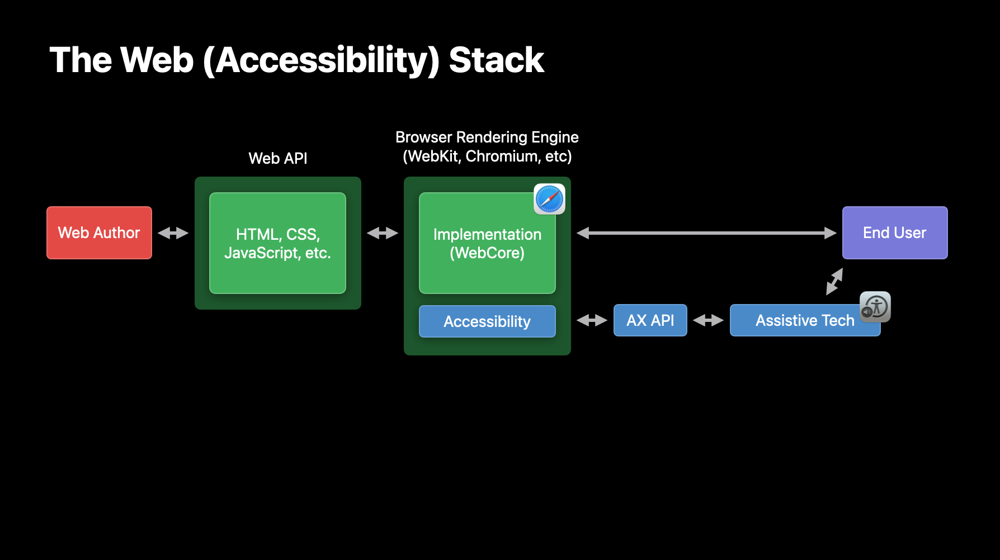

# ARIA Testing Documentation

## Some background

The images and text in this section come from James Craig's presentation on the [Accessibility Testing Investigation for WPT Interop 2023](https://github.com/web-platform-tests/interop-2023-accessibility-testing).

1. Web Author creates a website with HTML, CSS, and JS that is accessed in a browser.
2. In the case the mainstream interface that is accessed directly by those who do not use assistive technologies, the rendering engine (WebKit, Chromium, Gecko) handles all the input/output to and from the end user: input as mouse clicks, keyboard events, etc. and output as pixels rendered on screen, among other things.
3. In the case of accessibility technology use such as a screen reader, the engine has internal accessible code (such as WebCore/accessibility in WebKit) that interprets the rendered page and associated Web API, and then vends an equivalent to the associated platform accessibility API. In the case of this diagram, that is represented by the macOS "AX API."
4. In most cases, assistive technology (AT) such as a screen reader, will access data from the platform API, rather than by inspecting the Web APIs directly, though there are exceptions to this general rule.

For the stack described above, we have the following tests:
- **Client-Side Automation:** Like Deque's Axe-Core, these tests use standard JS, and run in most browsers, but are limited to static DOM-side checks of web content.
- **Cross-browser Automation:** Web Platform Tests are non-proprietary and runs in any browser, with the big benefit of having access to some engine internals (like `computedrole` and `computedlabel`) but also being executable in any browser. However the access to browser internals is limited to what the browser exposes through standard APIs (such as javascript and webdriver).
- **Engine-Specific Automation:** These tests, like WebKit's LayoutTests) are obviously engine-specific but have access to engine API internals and implementation details.
- **Platform-Specific Automation:** These tests are platform-specific but have access to platform accessibility API internals.

Additionally, there is an effort to write manual tests of screen reader support for ARIA features, which is called the [ARIA-AT project](https://aria-at.w3.org/).

## Tests of the ARIA specification

### ARIA "author MUST" / Validator Tests

Validator tests are written for "author MUST" or "author MUST NOT" statements. An "author MUST" statement is testable if an HTML validator (such as [AXE](https://www.deque.com/axe/) or [validator.nu](https://validator.nu/) can test whether a given piece of HTML conforms to the specification. Not all "author must" statements are testable. For example, the following statement is testable:

> In order for elements with a role of img to be perceivable, authors MUST provide a label using the aria-label or aria-labelledby attribute.

But the following statement is not testable, because managing focus is dynamic and cannot be done by an html validator:

> Authors MUST manage focus on the following container roles...

The validator tests belong in the [validator-test directory](https://github.com/w3c/aria/tree/main/validator-tests). When adding or updating a test, also supply the test results required in the [README](https://github.com/w3c/aria/tree/main/validator-tests/README.md).

### ARIA "user agent MUST"

Ideally, we should have a test suite to test all "user agent MUST" statements, but we do not have yet have all the TestDriver interfaces required to write many of these tests. WPT TestDriver (through WebDriver) gives us access to `computedrole` and `comutedlabel`, so we are now adding various role tests (ARIA, HTML-AAM, etc.) and name computation tests (AccName). The IDL interface is also testable in WPT.

If a change adds or changes a "user agent must" or "user agent must not" statement, please add a issue describing the test once the PR is ready for merge. 

### ARIA IDL Interface Tests

Automated tests for the [ARIA IDL interface](https://w3c.github.io/aria/#idl-interface) are in WPT. We have two test files:
* [aria-attribute-reflection.html](https://github.com/web-platform-tests/wpt/blob/master/html/dom/aria-attribute-reflection.html), [Results on wpt.fyi](https://wpt.fyi/results/html/dom/aria-element-reflection.html?label=experimental&label=master&aligned&view=subtest)
* [aria-element-reflection.html](https://github.com/web-platform-tests/wpt/blob/master/html/dom/aria-element-reflection.html), [Results on wpt.fyi](https://wpt.fyi/results/html/dom/aria-attribute-reflection.html?label=experimental&label=master&aligned&view=subtest)

When the IDL Interface section is updated, these tests should be update accordingly.

### WAI-ARIA Automated Tests

- [Results of ARIA tests in WPT](https://wpt.fyi/results/wai-aria?label=master&label=experimental&aligned)
- [Source of ARIA tests in WPT](https://github.com/web-platform-tests/wpt/tree/master/wai-aria)
- [Additional Issues for new automated tests](https://github.com/web-platform-tests/interop-2023-accessibility-testing/issues).
- **Manual Tests:** Some additional platform-specific tests mapping tests are located in [WPT's core-aam folder](https://github.com/web-platform-tests/wpt/tree/master/core-aam). They are "manual" tests in that you have to use a tool outside of the web browser and WPT test suite to inspect the accessibility API. For now, Valerie will maintain these CORE-AAM tests and no one else needs to write them.

### HTML-AAM Automated Tests

- [Results of HTML-AAM tests in WPT](https://wpt.fyi/results/html-aam?label=master&label=experimental&aligned)
- [Source of HTML-AAM tests in WPT](https://github.com/web-platform-tests/wpt/tree/master/html-aam)

## AccName Automated Tests

- [Results of AccName tests in WPT](https://wpt.fyi/results/accname?label=master&label=experimental&aligned)
- [Source of AccName tests in WPT](https://github.com/web-platform-tests/wpt/tree/master/accname)

### Interop 2023 Accessibility Investigation 

Many of the automated tests in listed above started as a [Accessibility Investigation](https://github.com/web-platform-tests/interop-2023-accessibility-testing) for Web Platform Tests Interop 2023. Revew the [Issues List](https://github.com/web-platform-tests/interop-2023-accessibility-testing/issues) and [Scoring Criteria](https://github.com/web-platform-tests/interop-2023-accessibility-testing/issues/3) for more detail.

### Running (and writing) WPT Tests for ARIA and Related Specs

Start with [Running the WPT Tests for ARIA and Related Specs](./wpt.md).

For detailed guidance on writing tests for the purposes of accessibility interoperability, please visit: [Accessibility Interop Project Overview and Contribution Guidelines](https://github.com/web-platform-tests/interop-accessibility/wiki/Accessibility-Interop-Project-Overview-and-Contribution-Guidelines).

